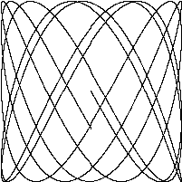

# Animations

This sub-section contains some beautiful animations made with maths and code.

## Lissajous

A Lissajous curve, also known as Lissajous figure or Bowditch curve, is the graph of a system of parametric equations.

$${\displaystyle x=A\sin(at+\delta ),\quad y=B\sin(bt),}x=A\sin(at+\delta ),\quad y=B\sin(bt),$$

which describe [complex harmonic motion](https://en.m.wikipedia.org/wiki/Complex_harmonic_motion). This family of [curves](https://en.m.wikipedia.org/wiki/Curve) was investigated by Nathaniel Bowditch in 1815, and later in more detail in 1857 by Jules Antoine Lissajous (for whom it has been named).

**Code**:

```go
./lissajous.go
// Lissajous generates GIF animations of random Lissajous figures.

package main

import (
    "io"
    "os"
    "image"
    "image/color"
    "image/gif"
    "math"
    "math/rand"
)

var pallete = []color.Color{color.White, color.Black}

const (
    whiteIndex = 0 // first color in pallete
    blackIndex = 1 // next color in pallete
)

func main() {
    // TODO: Exercise 1.5
    lissajous(os.Stdout)
}

func lissajous(out io.Writer) {
    const (
        // number of complete oscillator revolutions
        cycles  = 5
        res     = 0.001 // angular resolution
        size    = 100 // image canvas covers
        // [-size...+size]
        nframes = 64 // no. of animation frames
        delay   = 8 // delay b/w frames in 10ms units
    )
    // relative frequency of y oscillator
    freq := rand.Float64() * 3 
    anim := gif.GIF{LoopCount: nframes}
    phase := 0.5 // phase difference
    for i := 0; i < nframes; i++ {
        rect := image.Rect(0, 0, 2*size+1, 2*size+1)
        img := image.NewPaletted(rect, pallete)
        for t := 0.0; t<cycles*2*math.Pi; t += res {
            x := math.Sin(t)
            y := math.Sin(t*freq + phase)
            img.SetColorIndex(
                size + int(x*size + 0.5),
                size + int(y*size + 0.5),
                blackIndex,   
            )
        }
        phase += 0.1
        anim.Delay = append(anim.Delay, delay)
        anim.Image = append(anim.Image, img)
    }
    gif.EncodeAll(out, &anim)
    // NOTE: ignoring encoding errors
}
```

**Output**:



**Modifying**:

For changing number of cycles, resolution, size, number of frames or delay b/w frames you can change these constants.
```go
const (
    // number of complete oscillator revolutions
    cycles  = 5
    res     = 0.001 // angular resolution
    size    = 100 // image canvas covers
    // [-size...+size]
    nframes = 64 // no. of animation frames
    delay   = 8 // delay b/w frames in 10ms units
)
```

---
