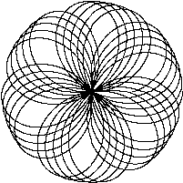

# Animations

This sub-section contains some beautiful animations made with maths and code.

## Lissajous

A Lissajous curve, also known as Lissajous figure or Bowditch curve, is the graph of a system of parametric equations

$${\displaystyle x=A\sin(at+\delta ),\quad y=B\sin(bt),}$$

which describe [complex harmonic motion](https://en.m.wikipedia.org/wiki/Complex_harmonic_motion). This family of [curves](https://en.m.wikipedia.org/wiki/Curve) was investigated by Nathaniel Bowditch in 1815, and later in more detail in 1857 by Jules Antoine Lissajous (for whom it has been named).

### Code

```go
// ./lissajous.go
// Lissajous generates GIF animations of random Lissajous figures.

package main

import (
    "io"
    "os"
    "time"
    "image"
    "image/color"
    "image/gif"
    "math"
    "math/rand"
)

var pallete = []color.Color{color.White, color.Black}

const (
    whiteIndex = 0 // first color in pallete
    blackIndex = 1 // next color in pallete
)

func main() {
    rand.Seed(time.Now().UTC().UnixNano())
    lissajous(os.Stdout)
}

func lissajous(out io.Writer) {
    const (
        // number of complete oscillator revolutions
        cycles  = 5
        res     = 0.001 // angular resolution
        size    = 100 // image canvas covers
        // [-size...+size]
        nframes = 64 // no. of animation frames
        delay   = 8 // delay b/w frames in 10ms units
    )
    // relative frequency of y oscillator
    freq := rand.Float64() * 3 
    anim := gif.GIF{LoopCount: nframes}
    phase := 0.5 // phase difference
    for i := 0; i < nframes; i++ {
        rect := image.Rect(0, 0, 2*size+1, 2*size+1)
        img := image.NewPaletted(rect, pallete)
        for t := 0.0; t<cycles*2*math.Pi; t += res {
            x := math.Sin(t)
            y := math.Sin(t*freq + phase)
            img.SetColorIndex(
                size + int(x*size + 0.5),
                size + int(y*size + 0.5),
                blackIndex,   
            )
        }
        phase += 0.1
        anim.Delay = append(anim.Delay, delay)
        anim.Image = append(anim.Image, img)
    }
    gif.EncodeAll(out, &anim)
    // NOTE: ignoring encoding errors
}
```

#### Output:

Usage:
```bash
go build lissajous.go
./lissajous > out.gif
```


> Note: This program creates random figures, above one is one of them.

#### Rendering on webpage

```go
if len(os.Args) > 1 && os.Args[1] == "web" {
	handler := func(w http.ResponseWriter, r *http.Request) {
		lissajous(w)
	}
	http.HandleFunc("/", handler)
	log.Fatal(http.ListenAndServe("localhost:8000", nil))
	return
```
Run the program with argument "web", and visit
`localhost:8000` to see the figures. *Reload the page for randomness.*

Usage:
```bash
./lissajous web
```

#### Modifying:

For changing number of cycles, resolution, size, number of frames or delay b/w frames you can change these constants.
```go
const (
    // number of complete oscillator revolutions
    cycles  = 5
    res     = 0.001 // angular resolution
    size    = 100 // image canvas covers
    // [-size...+size]
    nframes = 64 // no. of animation frames
    delay   = 8 // delay b/w frames in 10ms units
)
```

## Rose petals

In mathematics, a rose or rhodonea curve is a sinusoid specified by either the cosine or sine functions with no phase angle that is plotted in polar coordinates. Rose curves or "rhodonea" were named by the Italian mathematician who studied them, Guido Grandi, between the years 1723 and 1728.

A rose is the set of points in polar coordinates specified by the [polar equation](https://en.m.wikipedia.org/wiki/Polar_equation)

$${\displaystyle r=a\cos(k\theta )}$$

or in Cartesian coordinates using the parametric equations

$${\displaystyle x=r\cos(\theta )=a\cos(k\theta )\cos(\theta )}$$
$${\displaystyle y=r\sin(\theta )=a\cos(k\theta )\sin(\theta )}$$.

### Implementation

We can use mostly all of the code from the above program [lissajous](#lissajous) and just modify the equations.

```go
x := math.Cos(t*freq) * math.Cos(t)
y := math.Cos(t*freq) * math.Sin(t)
```

#### Ouput


#### Scaling (Horizantally)

Scale the *x coordinate* with variable `a`.
Scaling depends on `a`, try to experiment it yourself.

```go
// ...
phase := 0.5 // phase difference
a := 0.5 // <- to be noted

for i := 0; i < nframes; i++ {
    rect := image.Rect(0, 0, 2*size+1, 2*size+1)
    img := image.NewPaletted(rect, pallete)
    a += 0.5 // <- to be noted

    for t := 0.0; t < cycles*2*math.Pi; t += res {
        // equations:
        x := a*math.Cos(t*freq) * math.Cos(t)
        y := math.Cos(t*freq) * math.Sin(t)
        // ...
```


#### Scaling (Vertically)

Scale the *y coordinate* with variable `a`.
Scaling depends on `a`, try to experiment it yourself.
```go
// ...
phase := 0.5 // phase difference
a := 0.5 // <- to be noted

for i := 0; i < nframes; i++ {
    rect := image.Rect(0, 0, 2*size+1, 2*size+1)
    img := image.NewPaletted(rect, pallete)
    a += 0.5 // <- to be noted

    for t := 0.0; t < cycles*2*math.Pi; t += res {
        // equations:
        x := math.Cos(t*freq) * math.Cos(t)
        y := a*math.Cos(t*freq) * math.Sin(t)
        // ...
```



#### Zooming In

Scale the *x and y coordinate* with variable `a`.
Scaling depends on `a`, try to experiment it yourself.

```go
// ...
phase := 0.5 // phase difference
a := 0.5 // <- to be noted

for i := 0; i < nframes; i++ {
    rect := image.Rect(0, 0, 2*size+1, 2*size+1)
    img := image.NewPaletted(rect, pallete)
    a += 0.5 // <- to be noted

    for t := 0.0; t < cycles*2*math.Pi; t += res {
        // equations:
        x := a*math.Cos(t*freq) * math.Cos(t)
        y := a*math.Cos(t*freq) * math.Sin(t)
        // ...
```


---
